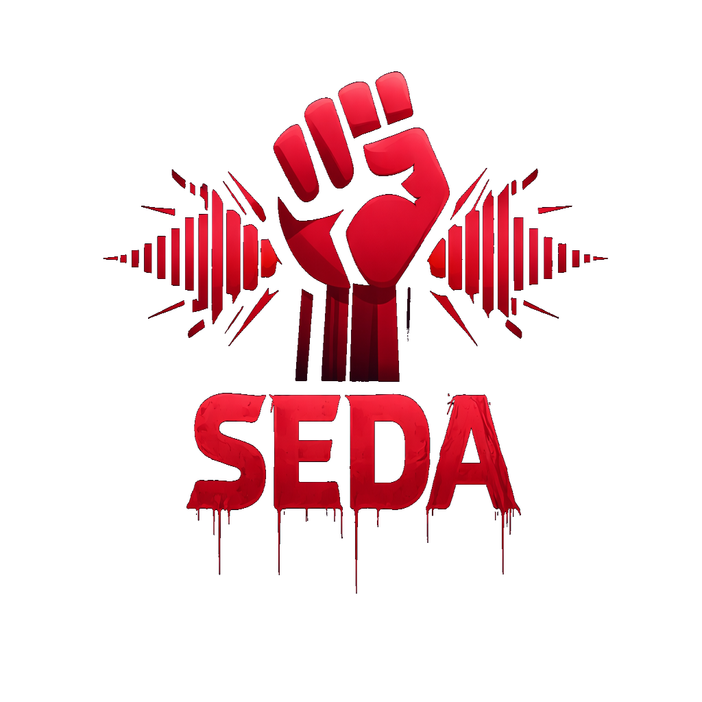

<p align="center">
  
</p>

<h1 align="center">SEDA</h1>
<h3 align="center">State-linked Entity Detection & Analysis</h3>

<p align="center">
  <strong>Exposing Iranian regime propaganda networks on Twitter/X</strong>
</p>

<p align="center">
  <a href="#mission">Mission</a> •
  <a href="#detection-methods">Detection Methods</a> •
  <a href="#quick-start">Quick Start</a> •
  <a href="#contributing">Contributing</a>
</p>

---

## Mission

SEDA is an open-source intelligence platform designed to identify and expose Iranian regime-affiliated Twitter accounts that spread state propaganda.

**Why this matters:**
- State-sponsored accounts manipulate public discourse during protests and crises
- Coordinated networks amplify regime narratives while suppressing opposition voices
- Identifying these accounts helps researchers, journalists, and activists understand information warfare

**What SEDA does:**
- Detects bot-like behavior using 27+ behavioral features
- Classifies political stance using Persian NLP and keyword analysis
- Identifies coordination patterns (synchronized posting, hashtag campaigns, amplification networks)
- Provides a dashboard to explore and export findings

---

## Detection Methods

### 1. Bot Detection (Heuristic Scoring)

SEDA uses behavioral heuristics to score accounts for bot probability:

| Feature Category | Signals |
|-----------------|---------|
| **Profile Analysis** | Username digit ratio, bio presence, default avatar, account age |
| **Posting Patterns** | Hour entropy, night posting (2-6am Iran time), interval regularity |
| **Content Behavior** | Retweet ratio, duplicate content, hashtag flooding |
| **Engagement Signals** | Zero engagement ratio, engagement variance |

### 2. Stance Classification

Accounts are classified based on political alignment:

| Stance | Detection Method |
|--------|-----------------|
| **Pro-Regime** | Keywords like "رهبر معظم" (Supreme Leader), "محور مقاومت" (Axis of Resistance), regime hashtags |
| **Anti-Regime** | Keywords like "زن زندگی آزادی" (Woman Life Freedom), "مرگ بر دیکتاتور" (Death to Dictator) |
| **Neutral/Unknown** | No clear signals or mixed content |

Supports both Persian (فارسی) and English keyword detection.

### 3. Amplifier Detection

Identifies accounts that exist primarily to amplify regime content:

- **Follower Networks**: Accounts following multiple regime seeds
- **Retweet Behavior**: Disproportionate retweeting of state media
- **Co-amplification**: Accounts that amplify the same content together

### 4. Coordination Detection

Detects coordinated inauthentic behavior:

| Method | Description |
|--------|-------------|
| **Synchronized Posting** | Near-duplicate tweets within short time windows (MinHash LSH) |
| **Hashtag Campaigns** | Sudden hashtag spikes driven by small account clusters |
| **Amplification Networks** | Community detection on retweet graphs (Louvain algorithm) |

---

## Quick Start

### Prerequisites

- Python 3.11+
- [Apify](https://apify.com) account (free tier: 10K results/month)
- [Anthropic API key](https://console.anthropic.com) (optional, for LLM classification)

### Installation

```bash
# Clone repository
git clone https://github.com/kian-vos/seda.git
cd seda

# Create virtual environment
python3 -m venv .venv
source .venv/bin/activate

# Install dependencies
pip install -e ".[dev]"

# Configure environment
cp .env.example .env
# Edit .env with your API keys
```

### Basic Usage

```bash
# 1. Initialize seed accounts
python -m scripts.seed_accounts init

# 2. Collect data from seeds
python -m scripts.collect seeds --tweets 50

# 3. Expand network (find followers/retweeters)
python -m scripts.collect followers --all-seeds --max 200

# 4. Run analysis
python -m scripts.analyze all

# 5. Launch dashboard
streamlit run dashboard/app.py
```

### Dashboard

Access the dashboard at `http://localhost:8501` to:
- View identified pro-regime accounts
- Explore coordination clusters
- Export data for further analysis

---

## Project Structure

```
seda/
├── analysis/
│   ├── bot.py           # Bot detection (heuristic scoring)
│   ├── stance.py        # Stance classification
│   ├── coordination.py  # Coordination detection
│   ├── nlp.py          # Persian NLP processing
│   └── features.py     # Feature extraction (27 features)
├── scraper/
│   └── twitter.py      # Apify Twitter scraper
├── db.py               # SQLite database
└── models.py           # Data models

dashboard/
└── app.py              # Streamlit dashboard

scripts/
├── collect.py          # Data collection CLI
├── analyze.py          # Analysis pipeline CLI
└── seed_accounts.py    # Seed account management
```

---

## Deployment

### Local Development
Data is stored in `data/seda.db` (SQLite). This works great for local development and research.

### Streamlit Cloud
**Important:** Streamlit Cloud uses ephemeral storage. Your database will reset on every deploy/restart.

For persistent deployment, you'll need an external database:
- [Supabase](https://supabase.com) (free PostgreSQL)
- [PlanetScale](https://planetscale.com) (free MySQL)
- [Turso](https://turso.tech) (free edge SQLite)

Or pre-load exported CSV data on startup.

---

## Contributing

**We welcome contributions!** This is an open-source project fighting information warfare.

### How to Contribute

1. **Report Issues**: Found a bug or have a suggestion? [Open an issue](https://github.com/kian-vos/seda/issues)

2. **Add Seed Accounts**: Know verified regime-affiliated accounts? Submit a PR to add them

3. **Improve Detection**:
   - Add new Persian/English keywords for stance detection
   - Improve bot detection heuristics
   - Add new coordination detection algorithms

4. **Documentation**: Help improve docs, add examples, translate to Persian

5. **Code Contributions**:
   ```bash
   # Fork the repo, then:
   git checkout -b feature/your-feature
   # Make changes
   git commit -m "Add your feature"
   git push origin feature/your-feature
   # Open a Pull Request
   ```

### Guidelines

- Follow existing code style
- Add tests for new features
- Update documentation as needed
- Be respectful in discussions

---

## Disclaimer

This tool is for research and educational purposes. Users are responsible for complying with Twitter/X Terms of Service and applicable laws. The goal is transparency and accountability, not harassment.

---

## License

MIT License - See [LICENSE](LICENSE) for details.

---

<p align="center">
  <strong>For those who fight for freedom.</strong>
</p>
